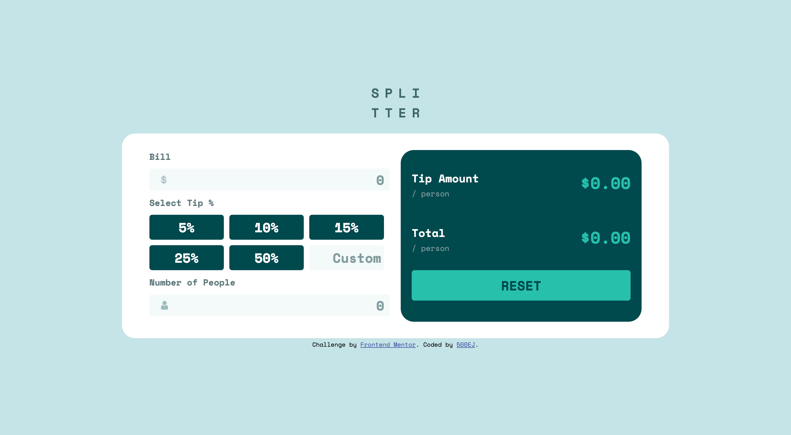

# Frontend Mentor - Tip Calculator

This is a solution to the [Tip Calculator challenge on Frontend Mentor](https://www.frontendmentor.io/challenges/tip-calculator-app-ugJNGbJUX). Frontend Mentor challenges help you improve your coding skills by building realistic projects.

## Table of contents

- [Overview](#overview)
  - [The challenge](#the-challenge)
  - [Screenshot](#screenshot)
  - [Links](#links)
- [My process](#my-process)
  - [Built with](#built-with)
- [Author](#author)

**Note: Delete this note and update the table of contents based on what sections you keep.**

## Overview

### The challenge

Users should be able to:

- Calculate the correct tip and total cost of the bill per person
- Use the desktop or mobile site based on their screen size
- Reset all form data by using the "RESET" button

### Screenshot

### Links

- Solution URL: [Repository](https://github.com/500EJ/tip-calculator)
- Live Site URL: [Website](https://500ej-tipcalculator.netlify.app)

## My Process

### Built with

- Semantic HTML5 markup
- CSS custom properties
- Flexbox
- Mobile-first workflow
- Latest ES6 JavaScript Syntax

## Author

- GitHub - [@500EJ](https://github.com/500EJ)
- Frontend Mentor - [@500EJ](https://www.frontendmentor.io/profile/500EJ)
